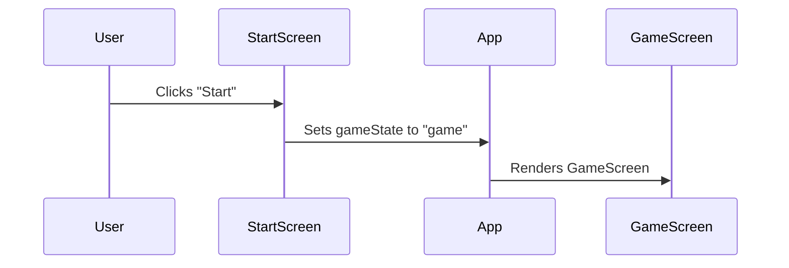
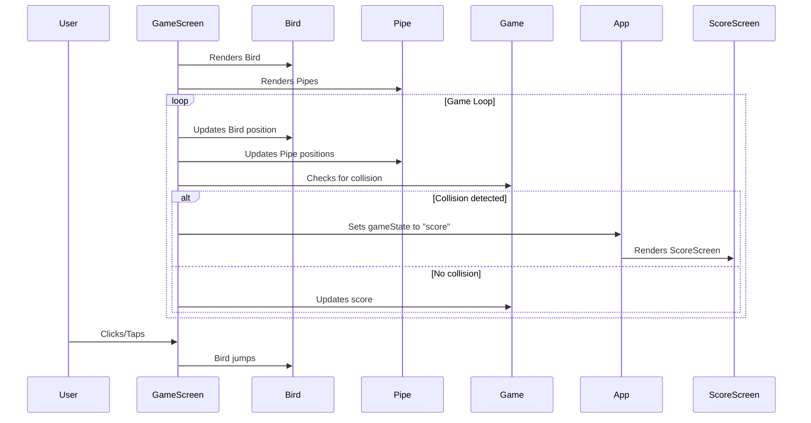
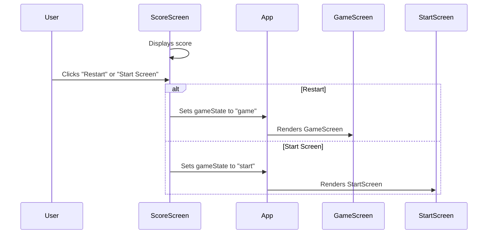

# Flappy Bird Game Plan

## 1. Project Setup and Initialization:

*   Set up a new React project using Vite with TypeScript.
*   Configure Tailwind CSS v3.4.17 in the project.
*   Define the basic project structure, including directories for components, assets, and styles.

## 2. Game Flow Sequences (Mermaid Diagrams):

*   **Start Screen:**

*   **Game Screen:**

*   **Score Screen:**

## 3. Components and Classes:

*   **App Component:**
    *   The main component that manages the overall game state and renders different screens based on the current game state.
*   **StartScreen Component:**
    *   Renders the start screen UI using Tailwind CSS.
    *   Handles the "Start" button click event.
*   **GameScreen Component:**
    *   Renders the game UI, including the bird, pipes, and background, using Tailwind CSS.
    *   Manages the game loop and updates the game state.
*   **ScoreScreen Component:**
    *   Renders the score screen UI using Tailwind CSS.
    *   Displays the player's score and provides options to restart or return to the start screen.
*   **Bird Component:**
    *   Represents the bird object.
    *   Handles bird movement and animation.
*   **Pipe Component:**
    *   Represents a single pipe.
    *   Handles pipe movement and collision detection.
*   **Game Class/Module:**
    *   Encapsulates the core game logic.
    *   Manages game state, collision detection, and score updates.

## 4. Assets:

*   Bird sprite (using available HTML elements or simple CSS/Tailwind).
*   Pipe design (using available HTML elements or simple CSS/Tailwind).
*   Background image or color.

## 5. Technologies:

*   React: For building the UI components.
*   Vite: For fast development and build process.
*   TypeScript: For type safety and improved code maintainability.
*   Tailwind CSS v3.4.17: For styling the game elements.
*   HTML: For structuring the game elements.
*   Mermaid: For creating the game flow diagrams.

## 6. Detailed Plan:

1.  Set up the project: Use Vite to create a React project with TypeScript and configure Tailwind CSS v3.4.17.
2.  Create Mermaid diagrams: Create Mermaid diagrams for the start screen, game screen, and score screen flows.
3.  Create components: Implement the `App`, `StartScreen`, `GameScreen`, `ScoreScreen`, `Bird`, and `Pipe` components.
4.  Implement game logic: Develop the `Game` class/module to handle game state, collision detection, and score updates.
5.  Add assets: Include the bird sprite, pipe design, and background.
6.  Implement game flow: Connect the components and game logic to create the complete game flow.
7.  Style the game: Use Tailwind CSS to style the game elements and create an appealing visual experience.